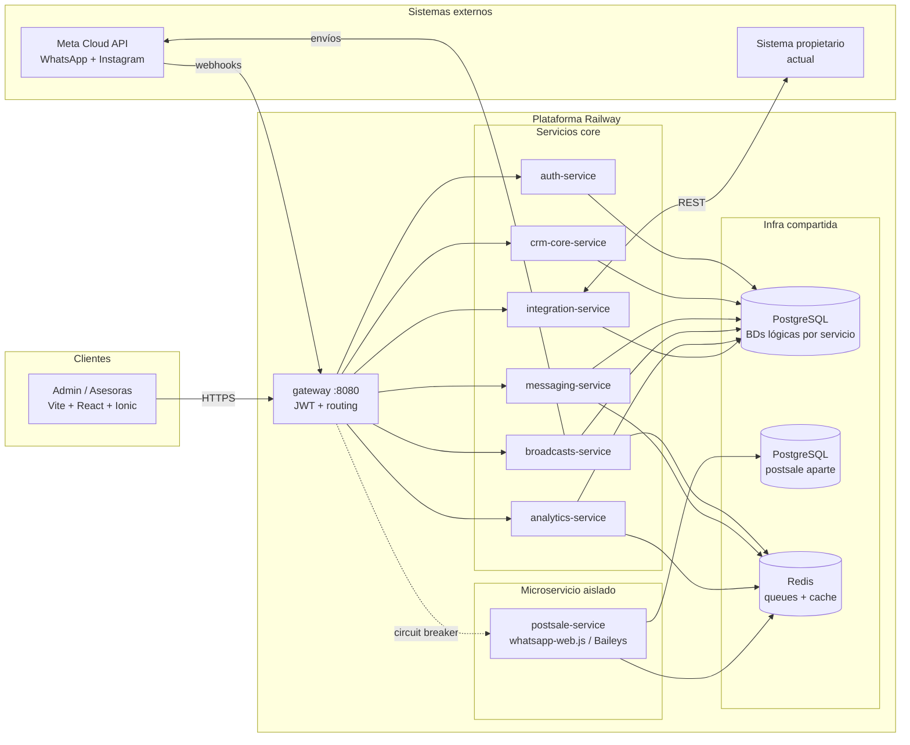
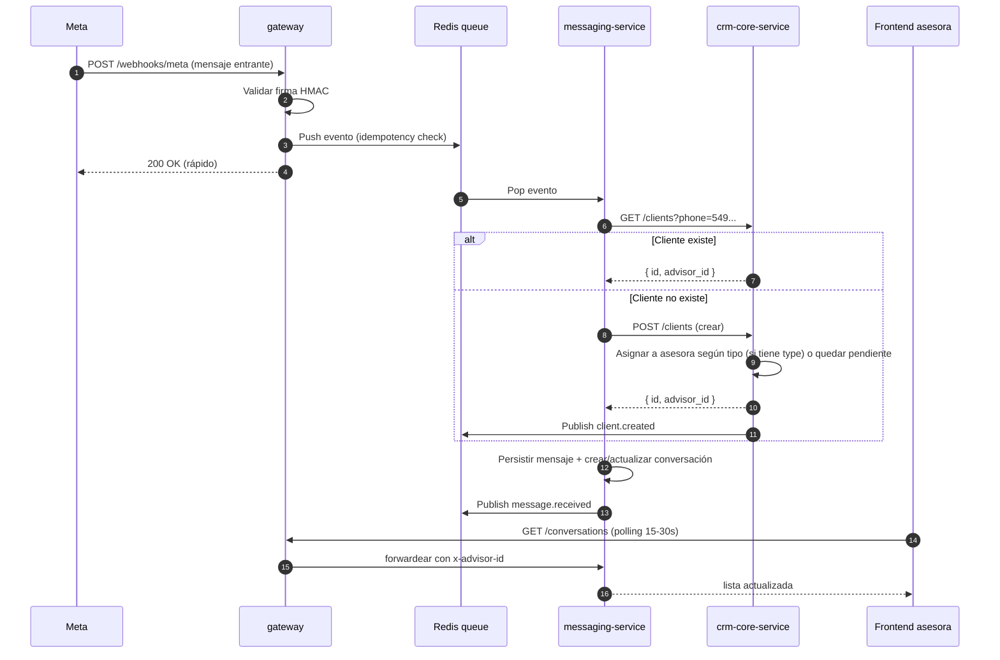

# 01 — Arquitectura

> Documento de arquitectura del CRM paralelo de **La Internacional**. Es la vista de sistema: cómo se descomponen los servicios, cómo se comunican, cómo se despliegan y cómo se aíslan los componentes de mayor riesgo.

---

## 1. Objetivo del sistema

Construir un CRM B2B propio para La Internacional que:

- Unifica la atención por WhatsApp (5 líneas) e Instagram en una sola bandeja.
- Asigna automáticamente clientes a asesoras según el "tipo" del cliente.
- Elimina la fricción de revisar manualmente si un teléfono ya pertenece a alguien.
- Dispara difusiones masivas legales por WhatsApp Cloud API.
- Permite postventa automatizada 1:1 sin pagar plantillas (motor "camuflado" en microservicio aislado).
- Mide tasas de conversión por estado y costo por estado en función del gasto en difusiones.
- Se sincroniza bidireccionalmente con el sistema propietario actual (mantenido por un freelance) para cruzar comprobantes y cerrar ventas.

El sistema vive **en paralelo** al sistema actual de gestión de La Internacional: BD separada, duplicando algunos datos a propósito.

---

## 2. Vista de alto nivel



---

## 3. Descomposición en servicios

| Servicio | Responsabilidad | Por qué está aparte |
|---|---|---|
| **gateway** | JWT, routing, headers de identidad, rate limiting | Punto único de entrada; protege a los demás |
| **auth-service** | Usuarios admin/asesoras, login, roles, mapping asesora↔teléfono | Aislado por seguridad y reuso |
| **crm-core-service** | Clientes, anti-duplicación, tipos, asignación, segmentación, tags | Es el "núcleo" de datos de negocio; lo consume todo |
| **messaging-service** | Bandeja unificada, conversaciones, mensajes, estados de chat | Volumen alto y crece con el tráfico de mensajes |
| **broadcasts-service** | Listas dinámicas, plantillas Cloud API, envíos masivos, opt-in/out | Lógica específica de Meta Cloud API + costo por mensaje |
| **postsale-service** | Postventa "camuflada" 1:1 con whatsapp-web.js/Baileys, una sesión por asesora | **Aislado por riesgo de baneo**: ToS de Meta lo prohíbe; si se cae no rompe nada más |
| **analytics-service** | Embudos, tasas de conversión por estado, costo por estado por difusión | Workload de lectura agregada; se beneficia de cachear |
| **integration-service** | Adapter REST hacia el sistema propietario actual; cruce de comprobantes | Encapsula la dependencia externa; cambia con su API |

**Rationale de la división:** seguimos el mismo patrón que el Marketplace de Da Vinci (gateway + servicios NestJS independientes), porque ya conocemos el modelo y Railway lo soporta sin fricción. Cada servicio es un proceso de Railway separado con su propia URL interna.

---

## 4. Topología de despliegue en Railway

```
Proyecto Railway: la-internacional-crm
├── Service: gateway              (Node, exposed public, custom domain)
├── Service: auth-service         (Node, internal only)
├── Service: crm-core-service     (Node, internal only)
├── Service: messaging-service    (Node, internal only)
├── Service: broadcasts-service   (Node, internal only)
├── Service: analytics-service    (Node, internal only)
├── Service: integration-service  (Node, internal only)
├── Service: postsale-service     (Node, internal only, restart policy aislada)
├── Plugin:  PostgreSQL           (un cluster, BDs lógicas por servicio)
├── Plugin:  PostgreSQL postsale  (cluster aparte, datos aislados)
├── Plugin:  Redis                (queues + cache)
└── Service: frontend             (static build de Vite + React + Ionic, servido por Caddy)
```

### Convenciones Railway

- **URLs internas:** `http://<service>.railway.internal:<port>`. El gateway las consume; el público solo ve la URL del gateway y del frontend.
- **Variables de entorno:** se definen por servicio en el dashboard de Railway, nunca en el repo. Ver [05-Requerimientos-Tecnicos.md](05-Requerimientos-Tecnicos.md) para el listado completo.
- **Health checks:** cada servicio expone `GET /health` que Railway monitorea.
- **Restart policy:** `on-failure` con backoff. El `postsale-service` tiene su propia política para no degradar la cuenta principal.
- **Logs:** centralizados en Railway. En producción real conviene Logtail o similar.

---

## 5. Patrones cross-cutting

### 5.1 Autenticación (JWT en el gateway)

- Todo request del frontend lleva `Authorization: Bearer <jwt>`.
- El gateway valida la firma con `JWT_SECRET` (env var compartida con `auth-service`).
- Si es válido, inyecta headers a los servicios downstream:
  - `x-user-id`
  - `x-user-email`
  - `x-user-role` (`admin` | `advisor`)
  - `x-advisor-id` (si es asesora; permite scope de datos)
- Rutas excluidas (sin JWT): `POST /auth/login`, `POST /auth/register`, webhooks de Meta, `GET /health`.

Mismo patrón que ya usaste en el Marketplace de Da Vinci.

### 5.2 Eventos pub/sub entre servicios

Para evitar acoplamiento síncrono, usamos **Redis Pub/Sub** (alternativa: BullMQ con colas persistentes para eventos críticos).

| Evento | Publica | Consume | Propósito |
|---|---|---|---|
| `client.created` | crm-core | messaging, analytics | Notificar nueva entrada al CRM |
| `client.assigned` | crm-core | messaging, postsale | Asignar conversación al asesor correcto |
| `message.received` | messaging | crm-core, analytics | Triggear anti-duplicación + métricas |
| `broadcast.sent` | broadcasts | analytics | Registrar costo y receptores |
| `client.state.changed` | messaging | analytics | Actualizar embudo |
| `invoice.matched` | integration | crm-core, analytics | Cerrar venta + tasa de conversión final |

### 5.3 Aislamiento del microservicio postventa

El `postsale-service` corre **whatsapp-web.js** o **Baileys**, librerías no-oficiales que pueden:

- Ser baneadas por Meta sin previo aviso.
- Crashear por cambios en la web de WhatsApp.
- Consumir mucha memoria (cada sesión es un Chromium headless en whatsapp-web.js).

**Mitigaciones:**

- **Proceso aparte** con su propio Postgres y su propia queue.
- **Circuit breaker en el gateway:** si el `postsale-service` falla 5 veces seguidas, el gateway responde 503 a sus rutas durante 30s sin propagar el error.
- **Restart policy:** `on-failure` con max 10 reintentos antes de marcar el servicio como degradado y notificar al admin.
- **Sesiones persistidas:** el estado de cada sesión WhatsApp Web se guarda en disco (Volume de Railway) para no escanear QR cada deploy.
- **Recomendación:** Baileys sobre whatsapp-web.js. Baileys es más liviano (no usa Chromium), más rápido, mantiene mejor las sesiones y soporta multi-device nativo. La contra es que requiere implementar más cosas a mano.

### 5.4 Webhooks de Meta

- Endpoint público: `POST /webhooks/meta` en el gateway.
- **Verificación GET:** Meta hace handshake con `verify_token`; respondemos echo del challenge.
- **Verificación POST:** cada request lleva header `X-Hub-Signature-256`. Validamos HMAC SHA-256 con `META_APP_SECRET`. Si no matchea, descartamos.
- **Idempotencia:** cada evento Meta tiene `id` único. Lo guardamos en tabla `webhook_events` con índice único. Si llega duplicado, devolvemos 200 sin procesar.
- **Cola asíncrona:** el gateway encola el evento en Redis y responde 200 inmediatamente. El procesamiento real lo hace el `messaging-service` consumiendo la cola. Esto evita timeouts de Meta.

### 5.5 Manejo de errores y observabilidad

- Cada servicio loggea structured JSON (Pino o NestJS Logger).
- Request ID único por request (`x-request-id`) que viaja a todos los servicios downstream.
- Errores 5xx → log con stack + payload; nunca exponer al cliente.
- Métricas básicas a futuro: Prometheus + Grafana, fuera del alcance del prototipo.

---

## 6. Flujo end-to-end de ejemplo

**Escenario:** llega un mensaje nuevo de WhatsApp de un cliente desconocido.



**Punto crítico:** la asignación automática cliente↔asesora pasa en el `crm-core-service` cuando se crea el cliente. Si el cliente entrante no tiene un "tipo" inferible aún (porque es la primera vez), queda en estado "no asignado" y aparece en la cola del admin para que decida o lo cualifique el bot.

---

## 7. Integración con el sistema propietario actual

### 7.1 El problema

La Internacional ya tiene un sistema (mantenido por un freelance) que gestiona stock por colores/lotes, comprobantes y ventas. Nuestro CRM **no reemplaza** ese sistema; convive con él. Necesitamos:

1. Reflejar las ventas que ocurren allá en nuestro CRM (cerrar oportunidades).
2. Cruzar el "comprobante" del sistema propietario con la conversación de WhatsApp que originó la venta.
3. Consultar stock real por colores/lotes desde el chat sin duplicar datos.

### 7.2 La estrategia

Encapsulamos toda la dependencia en `integration-service` con **adapter pattern**:

```
[crm-core-service] ──► [integration-service] ──► [Sistema propietario]
                              │
                              └── adapter intercambiable
```

- El `integration-service` expone una API estable hacia adentro (`GET /external/stock/:sku`, `GET /external/invoices`, etc.).
- Internamente, el adapter habla con el sistema actual. Si mañana cambia o se reemplaza, se cambia solo el adapter sin tocar el resto.
- **Por ahora (sin docs del sistema actual):** definimos el contrato de API supuesto en este documento y desarrollamos un mock. Cuando tengamos sesión con el freelance, ajustamos.

### 7.3 Cruce de comprobantes (cierre de venta)

El requerimiento clave: cuando se crea un comprobante en el sistema actual, queremos que la conversación correspondiente en nuestro CRM cambie a estado "cerrada-comprada".

**Estrategia recomendada:** polling del `integration-service` cada N minutos al sistema actual pidiendo comprobantes nuevos, y matching por:

1. Teléfono del cliente del comprobante (campo más confiable).
2. Fecha del comprobante dentro de una ventana ±48hs respecto al último mensaje activo.
3. Asesora asignada (si el sistema actual lo registra).

Si hay match único → emite `invoice.matched` → `crm-core` actualiza estado del cliente y `analytics` cierra la conversión.

Si hay ambigüedad → la conversación queda marcada para revisión manual del admin (estado "match-pendiente").

**Alternativa mejor (si el freelance lo permite):** webhook desde el sistema actual hacia nuestro `integration-service` cuando se crea un comprobante. Más eficiente y en tiempo real.

**Pregunta abierta:** ¿los comprobantes en el sistema actual tienen una arquitectura de estados o son simplemente colorcitos? Esto define si podemos seguir el ciclo de vida del comprobante o solo el evento de creación. Está marcado en [05-Requerimientos-Tecnicos.md](05-Requerimientos-Tecnicos.md).

---

## 8. Seguridad

| Tema | Decisión |
|---|---|
| Secrets | Solo en variables de entorno de Railway. Nunca en repo. |
| JWT | HS256, secreto rotable, expiración 8h, refresh token aparte. |
| HTTPS | Forzado por Railway en endpoints públicos. |
| CORS | Whitelist con dominio del frontend; bloqueo del resto. |
| Rate limiting | En gateway, 100 req/min por IP por defecto; webhooks de Meta exentos. |
| Validación de webhooks | HMAC SHA-256 con `META_APP_SECRET`. |
| Passwords | bcrypt cost 12 (heredado del Marketplace). |
| Roles | `admin` (todo) vs `advisor` (sus clientes). El scope se aplica en cada servicio mediante `x-advisor-id`. |
| Audit log | `webhook_events` y eventos críticos quedan en BD para auditoría. |

---

## 9. Escalabilidad

Para el prototipo no es prioridad, pero el diseño la contempla:

- **+20.000 contactos:** los queries de búsqueda se basan en índices únicos por teléfono normalizado (E.164). Búsqueda por segmento usa índices compuestos.
- **Picos por congresos / lista semanal:** Redis con BullMQ permite encolar miles de envíos y procesarlos a la velocidad que la Cloud API permita (rate limit propio de Meta).
- **Microservicio postventa:** la limitación es por sesión WhatsApp Web (1 por asesora, máximo 5 sesiones simultáneas en el prototipo). Suficiente para el volumen actual.
- **Lectura analítica:** `analytics-service` puede cachear resultados pesados en Redis con TTL corto (5 min) para dashboards.

Si en el futuro se necesita más, la división por servicios permite escalar cada uno independientemente en Railway (subir CPU/RAM solo del que sufre).

---

## 10. Preparación para e-commerce (S2 2025)

El esquema de datos contempla:

- `clients` ya tiene espacio para credenciales profesionales y datos de envío.
- Las conversaciones se vinculan con un canal; sumar un canal `web` (chat en la tienda) es trivial.
- El `integration-service` ya maneja el catálogo del sistema actual; sumar un endpoint público para la tienda online es una extensión.

Ver detalles en [04-Base-de-Datos.md](04-Base-de-Datos.md).

---

## 11. Decisiones abiertas

Estas decisiones no se cierran acá porque dependen de input del cliente. Están listadas en [05-Requerimientos-Tecnicos.md](05-Requerimientos-Tecnicos.md):

- ¿Las asesoras ven solo sus clientes o todos? (afecta scoping en cada servicio)
- ¿Qué estados mínimos manejamos? (afecta `client_states` y embudo analítico)
- ¿El sistema actual tiene API documentada o vamos con mock + ajuste posterior?
- ¿Comprobantes con estados o colorcitos?
- ¿Confirmamos Baileys vs whatsapp-web.js para postventa? (recomendación: Baileys)
