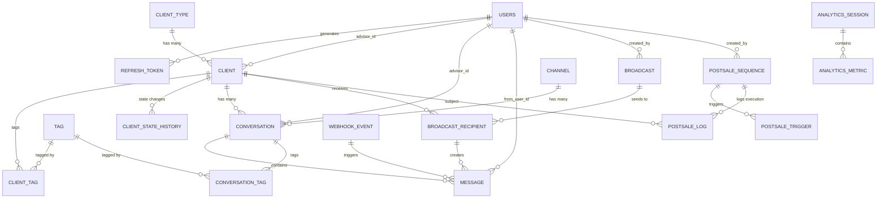

# Diagrama Entidad-Relación — Sistema CRM La Internacional

## Vista general del modelo de datos



---

## Modelo detallado por base de datos

### 📦 `lid_auth` — Autenticación y usuarios

#### `users`
| Campo | Tipo | Constraint | Propósito |
|-------|------|-----------|----------|
| `id` | UUID | PK | Identificador único |
| `email` | VARCHAR | UNIQUE, NOT NULL | Login único por email |
| `password_hash` | VARCHAR | NOT NULL | Bcrypt cost 12 |
| `display_name` | VARCHAR | NOT NULL | Nombre del usuario |
| `role` | ENUM(admin, advisor) | NOT NULL | Control de acceso |
| `phone_raw` | VARCHAR | nullable | Teléfono como lo ingresó |
| `phone_normalized` | VARCHAR | UNIQUE, nullable | E.164 de la asesora (crítico para postventa) |
| `active` | BOOLEAN | DEFAULT true | Soft disable sin borrar |
| `created_at` | TIMESTAMPTZ | DEFAULT now() | Auditoría |
| `updated_at` | TIMESTAMPTZ | AUTO | Auditoría |
| `deleted_at` | TIMESTAMPTZ | nullable | Soft delete |

**Índices:**
- `role` → para filtrar por tipo de usuario
- `email` → unique constraint

**Notas:**
- `phone_normalized` es **unique**: cada asesora = un teléfono (para sesiones de `postsale-service`)
- Passwords nunca en claro; validación en login con bcrypt

---

#### `refresh_tokens`
| Campo | Tipo | Constraint | Propósito |
|-------|------|-----------|----------|
| `id` | UUID | PK | Token ID |
| `user_id` | UUID | FK → users | Pertenece a usuario |
| `token_hash` | VARCHAR | UNIQUE | Hash del token actual |
| `expires_at` | TIMESTAMPTZ | NOT NULL | Momento de expiración |
| `revoked_at` | TIMESTAMPTZ | nullable | Si se revocó anticipadamente |
| `created_at` | TIMESTAMPTZ | DEFAULT now() | Auditoría |

**Relación:** `User 1-N RefreshToken`  
**Propósito:** Refresh tokens con rotación (seguridad + logout anticipado)

---

### 📦 `lid_crm` — Clientes y gestión central

#### `clients`
| Campo | Tipo | Constraint | Propósito |
|-------|------|-----------|----------|
| `id` | UUID | PK | Cliente único |
| `phone_raw` | VARCHAR | NOT NULL | Teléfono original |
| `phone_normalized` | VARCHAR | UNIQUE, NOT NULL | E.164 (anti-duplicación) |
| `name` | VARCHAR | nullable | Nombre completo |
| `email` | VARCHAR | nullable | Email contacto |
| `professional_credential` | VARCHAR | nullable | Matrícula profesional |
| `type_id` | UUID | FK → client_types | Tipo (Cosmetóloga, etc.) |
| `advisor_id` | UUID | FK (lógica) → users | Asesora asignada |
| `assigned_at` | TIMESTAMPTZ | nullable | Cuándo se asignó |
| `city` | VARCHAR | nullable | Localidad |
| `province` | VARCHAR | nullable | Provincia |
| `is_professional` | BOOLEAN | DEFAULT false | Marcador de profesional |
| `opt_in_broadcasts` | BOOLEAN | DEFAULT true | Consentimiento para difusiones |
| `opt_out_at` | TIMESTAMPTZ | nullable | Cuándo se dio de baja |
| `notes` | TEXT | nullable | Notas internas |
| `first_seen_at` | TIMESTAMPTZ | DEFAULT now() | Primera interacción |
| `last_activity_at` | TIMESTAMPTZ | nullable | Última actividad (para inactividad) |
| `created_at` | TIMESTAMPTZ | DEFAULT now() | Auditoría |
| `updated_at` | TIMESTAMPTZ | AUTO | Auditoría |
| `deleted_at` | TIMESTAMPTZ | nullable | Soft delete |

**Índices:**
- `advisor_id` → filtrar clientes por asesora
- `type_id` → segmentación
- `phone_normalized` → búsqueda antiduplicación
- `last_activity_at` → inactividad para postventa
- `(city, province)` → búsqueda geográfica

**Relaciones:**
- `N-1 ClientType` (muchos clientes, un tipo)
- `N-1 User` (advisor_id es FK lógica, valida externamente)
- `1-N ClientTag` (muchos tags por cliente)
- `1-N ClientStateHistory` (registro de cambios)

**Estados implícitos del cliente:** Recibido → Validación → Presupuestando → Sin comprobante → Agendado → Comprado

---

#### `client_types`
| Campo | Tipo | Constraint | Propósito |
|-------|------|-----------|----------|
| `id` | UUID | PK | Tipo de cliente |
| `name` | VARCHAR | UNIQUE, NOT NULL | "Cosmetóloga Córdoba" |
| `description` | VARCHAR | nullable | Detalle |
| `default_advisor_id` | UUID | nullable | Asesora por defecto para este tipo |
| `created_at` | TIMESTAMPTZ | DEFAULT now() | Auditoría |
| `updated_at` | TIMESTAMPTZ | AUTO | Auditoría |

**Propósito:** Clasificación de clientes → asignación automática a asesoras  
**Ejemplo:** Nuevo cliente tipo "Cosmetóloga Córdoba" → se asigna automáticamente a Asesora A

---

#### `tags`
| Campo | Tipo | Constraint | Propósito |
|-------|------|-----------|----------|
| `id` | UUID | PK | Tag único |
| `name` | VARCHAR | UNIQUE, NOT NULL | "VIP", "En seguimiento", etc. |
| `color` | VARCHAR(7) | nullable | Hex color (#FF0000) |
| `created_at` | TIMESTAMPTZ | DEFAULT now() | Auditoría |

**Propósito:** Clasificación flexible de clientes y conversaciones  
**Uso:** filtros en lista de clientes, segmentación de difusiones

---

#### `client_tags` (junction)
| Campo | Tipo | Constraint | Propósito |
|-------|------|-----------|----------|
| `client_id` | UUID | FK → clients | Cliente marcado |
| `tag_id` | UUID | FK → tags | Tag asignado |
| `created_at` | TIMESTAMPTZ | DEFAULT now() | Auditoría |

**Relación:** `Client N-N Tag` (muchos clientes con muchos tags)

---

#### `client_state_history`
| Campo | Tipo | Constraint | Propósito |
|-------|------|-----------|----------|
| `id` | UUID | PK | Registro único |
| `client_id` | UUID | FK → clients | Cliente que cambió |
| `conversation_id` | UUID | nullable | Conversación donde pasó |
| `previous_state` | VARCHAR | nullable | Estado anterior |
| `new_state` | VARCHAR | NOT NULL | Estado nuevo |
| `changed_by` | UUID | FK (lógica) → users | Quién lo cambió |
| `changed_at` | TIMESTAMPTZ | DEFAULT now() | Cuándo cambió |

**Índices:**
- `client_id` → historial por cliente
- `changed_at` → orden cronológico (analytics)

**Propósito:** Auditoría + reconstrucción del embudo de ventas para analytics

---

### 📦 `lid_messaging` — Bandeja unificada de mensajes

#### `channels`
| Campo | Tipo | Constraint | Propósito |
|-------|------|-----------|----------|
| `id` | UUID | PK | Canal único |
| `name` | VARCHAR | NOT NULL | "WhatsApp Asesora 1", "Instagram Oficial" |
| `type` | ENUM | NOT NULL | whatsapp_cloud \| instagram \| whatsapp_web |
| `identifier` | VARCHAR | UNIQUE | ID de Meta (phone_number_id, IG account id) |
| `active` | BOOLEAN | DEFAULT true | Activo/inactivo |
| `metadata` | JSONB | nullable | Config específica del canal |
| `created_at` | TIMESTAMPTZ | DEFAULT now() | Auditoría |

**Propósito:** Abstracción de canales (unifica WhatsApp + Instagram + sesiones postventa)

---

#### `conversations`
| Campo | Tipo | Constraint | Propósito |
|-------|------|-----------|----------|
| `id` | UUID | PK | Conversación única |
| `client_id` | UUID | FK → clients | Con quién es |
| `channel_id` | UUID | FK → channels | Por dónde (WhatsApp/IG) |
| `advisor_id` | UUID | FK (lógica) → users | Asesora responsable |
| `state` | VARCHAR | DEFAULT "recibido" | Estado actual del cliente |
| `last_message_at` | TIMESTAMPTZ | nullable | Cuándo fue el último mensaje |
| `unread_count` | INT | DEFAULT 0 | Mensajes sin leer |
| `created_at` | TIMESTAMPTZ | DEFAULT now() | Auditoría |
| `updated_at` | TIMESTAMPTZ | AUTO | Auditoría |

**Índices:**
- `client_id` → conversaciones del cliente
- `advisor_id` → bandeja de la asesora
- `channel_id` → por canal
- `state` → filtrar por estado
- `last_message_at` → ordenar "más reciente"

**Relaciones:**
- `N-1 Client` (una conversación con un cliente)
- `N-1 Channel` (un canal)
- `N-1 User` (advisor_id asignado)
- `1-N Message` (muchos mensajes en la conversación)
- `N-N Tag` (vía conversation_tags)

---

#### `messages`
| Campo | Tipo | Constraint | Propósito |
|-------|------|-----------|----------|
| `id` | UUID | PK | Mensaje único |
| `conversation_id` | UUID | FK → conversations | A qué conversación pertenece |
| `external_id` | VARCHAR | UNIQUE, nullable | wamid de Meta o ID de IG (idempotencia) |
| `direction` | ENUM | NOT NULL | inbound \| outbound |
| `content` | TEXT | nullable | Texto del mensaje |
| `media_url` | VARCHAR | nullable | URL del media (imagen, video, etc.) |
| `media_type` | VARCHAR | nullable | image \| video \| audio \| document |
| `from_user_id` | UUID | FK (lógica) → users | Si outbound, qué asesora envió |
| `status` | ENUM | DEFAULT "sent" | sent \| delivered \| read \| failed |
| `sent_at` | TIMESTAMPTZ | DEFAULT now() | Cuándo se envió |
| `delivered_at` | TIMESTAMPTZ | nullable | Cuándo se entregó (confirmed por Meta) |
| `read_at` | TIMESTAMPTZ | nullable | Cuándo se leyó (en el cliente) |

**Índices:**
- `(conversation_id, sent_at)` → timeline de conversación
- `external_id` → búsqueda de duplicados (webhook reentrant)

**Propósito:** Registro completo de mensajes para auditoría, reconexión de webhooks, analytics

---

#### `conversation_tags` (junction)
| Campo | Tipo | Constraint | Propósito |
|-------|------|-----------|----------|
| `conversation_id` | UUID | FK → conversations | Conversación |
| `tag_id` | UUID | FK → tags | Tag asignado |

**Relación:** `Conversation N-N Tag`

---

#### `webhook_events`
| Campo | Tipo | Constraint | Propósito |
|-------|------|-----------|----------|
| `id` | UUID | PK | Evento único |
| `source` | VARCHAR | NOT NULL | 'meta', 'instagram', etc. |
| `external_event_id` | VARCHAR | UNIQUE | ID del webhook (idempotencia) |
| `event_type` | VARCHAR | NOT NULL | message_received, message_sent, etc. |
| `payload` | JSONB | NOT NULL | JSON completo del webhook |
| `processed_at` | TIMESTAMPTZ | nullable | Cuándo se procesó |
| `received_at` | TIMESTAMPTZ | DEFAULT now() | Cuándo llegó |

**Propósito:** Auditoría de webhooks + replay en caso de fallos

---

### 📦 `lid_broadcasts` — Difusiones Meta

#### `broadcasts`
| Campo | Tipo | Constraint | Propósito |
|-------|------|-----------|----------|
| `id` | UUID | PK | Difusión única |
| `template_name` | VARCHAR | NOT NULL | Nombre en Meta |
| `template_id` | VARCHAR | nullable | ID de template en Meta |
| `segment_type` | VARCHAR | NOT NULL | Tipo de cliente (filtro) |
| `total_recipients` | INT | NOT NULL | Cuántos destinatarios |
| `sent_count` | INT | DEFAULT 0 | Cuántos enviados |
| `failed_count` | INT | DEFAULT 0 | Cuántos fallaron |
| `created_by_user_id` | UUID | FK → users | Quién creó |
| `sent_at` | TIMESTAMPTZ | nullable | Cuándo se ejecutó |
| `mode` | ENUM | NOT NULL | test \| production |
| `created_at` | TIMESTAMPTZ | DEFAULT now() | Auditoría |
| `updated_at` | TIMESTAMPTZ | AUTO | Auditoría |

**Propósito:** Registro de cada campaña masiva (auditoría + métricas)

---

#### `broadcast_recipients` (detalle)
| Campo | Tipo | Constraint | Propósito |
|-------|------|-----------|----------|
| `id` | UUID | PK | Registro de envío |
| `broadcast_id` | UUID | FK → broadcasts | A qué difusión pertenece |
| `client_id` | UUID | FK → clients | Destinatario |
| `message_id` | VARCHAR | nullable | wamid de Meta (confirmación) |
| `status` | ENUM | NOT NULL | sent \| delivered \| read \| failed |
| `sent_at` | TIMESTAMPTZ | DEFAULT now() | Cuándo se envió |
| `created_at` | TIMESTAMPTZ | DEFAULT now() | Auditoría |

**Propósito:** Detalle de cada envío (permite rastreo individual + costos)

---

### 📦 `lid_postsale` — Sesiones y secuencias de postventa (BD aislada)

#### `postsale_sequences`
| Campo | Tipo | Constraint | Propósito |
|-------|------|-----------|----------|
| `id` | UUID | PK | Secuencia única |
| `name` | VARCHAR | NOT NULL | "Bienvenida de compra", etc. |
| `trigger` | ENUM | NOT NULL | post_purchase \| inactivity \| birthday \| custom_days |
| `trigger_days` | INT | nullable | Si custom_days, cuántos días esperar |
| `template_name` | VARCHAR | NOT NULL | Nombre de template a usar |
| `template_variables` | JSONB | nullable | Mapeo de variables |
| `active` | BOOLEAN | DEFAULT true | Habilitada |
| `advisor_id` | UUID | nullable | Si solo para una asesora |
| `restrict_to_type` | VARCHAR | nullable | Si solo para cierto tipo de cliente |
| `created_by_user_id` | UUID | FK → users | Quién creó |
| `created_at` | TIMESTAMPTZ | DEFAULT now() | Auditoría |
| `updated_at` | TIMESTAMPTZ | AUTO | Auditoría |

**Propósito:** Automatización de mensajes 1:1 (postventa "camuflada" vía whatsapp-web.js)

---

#### `postsale_logs` (auditoría de ejecuciones)
| Campo | Tipo | Constraint | Propósito |
|-------|------|-----------|----------|
| `id` | UUID | PK | Ejecución única |
| `sequence_id` | UUID | FK → postsale_sequences | Secuencia ejecutada |
| `client_id` | UUID | FK → clients | Destinatario |
| `advisor_id` | UUID | FK → users | Asesora que envió |
| `message_id` | VARCHAR | nullable | ID de mensaje en Meta/WhatsApp Web |
| `status` | ENUM | NOT NULL | sent \| failed \| pending |
| `error_message` | TEXT | nullable | Si falló, por qué |
| `sent_at` | TIMESTAMPTZ | DEFAULT now() | Cuándo se envió |
| `created_at` | TIMESTAMPTZ | DEFAULT now() | Auditoría |

**Propósito:** Historial de mensajes automáticos (auditoría + debugging)

---

### 📦 `lid_analytics` — Métricas y embudos

#### `analytics_sessions` (snapshots de métricas)
| Campo | Tipo | Constraint | Propósito |
|-------|------|-----------|----------|
| `id` | UUID | PK | Sesión de análisis |
| `period_start` | DATE | NOT NULL | Inicio del período |
| `period_end` | DATE | NOT NULL | Fin del período |
| `total_clients` | INT | NOT NULL | Clientes únicos en período |
| `clients_by_state` | JSONB | NOT NULL | `{ "recibido": 50, "en_validacion": 30, ... }` |
| `conversion_rate` | DECIMAL | NOT NULL | % clientes que llegaron a "comprado" |
| `avg_cost_per_state` | JSONB | NOT NULL | `{ "recibido": 0.5, "en_validacion": 1.2, ... }` |
| `created_at` | TIMESTAMPTZ | DEFAULT now() | Auditoría |

**Propósito:** Snapshots agregados para dashboards (no recalcular en cada request)

---

## Relaciones de negocio

### Flujo de un cliente

1. **Cliente ingresa** → `INSERT clients` (phone_normalized es UNIQUE, anti-duplicación)
2. **Se asigna tipo** → `type_id` → busca `client_types.default_advisor_id` → `advisor_id`
3. **Primera interacción** → webhook de Meta → `INSERT messages` en `messages` → `POST /webhooks/meta` en gateway
4. **Conversación se crea** → `INSERT conversations` (client_id, channel_id, advisor_id)
5. **Cambio de estado** → `INSERT client_state_history` (rastreo para analytics)
6. **Mensajes de seguimiento** → `INSERT messages` (outbound desde asesora)

### Flujo de difusión

1. **Admin crea difusión** → `INSERT broadcasts` (segment_type, template_name)
2. **Se calcula segmento** → `SELECT * FROM clients WHERE type_id = ? AND opt_in_broadcasts`
3. **Se valida template** → Meta API
4. **Se envía masivamente** → por cada cliente, `POST /meta/.../messages`, `INSERT broadcast_recipients`
5. **Meta devuelve webhooks** → `INSERT webhook_events`, actualiza `messages.status` y `broadcast_recipients.status`
6. **Analytics consume eventos** → inserta `analytics_sessions` con métricas

### Flujo de postventa

1. **Cliente marcado como comprado** → evento `client.state.changed` → Redis pub/sub
2. **Postsale-service consume evento** → busca `postsale_sequences` activas
3. **Inicia sesión WhatsApp Web** → whatsapp-web.js/Baileys, espera QR
4. **Cuando está listo** → envía mensaje 1:1 vía sesión (no Cloud API, ToS exemption)
5. **Registra en `postsale_logs`** → auditoría completa

---

## Patrones de datos clave

### Anti-duplicación
```sql
-- Búsqueda antes de insertar
SELECT * FROM clients 
WHERE phone_normalized = '5493511234567'
LIMIT 1;
```

### Segmentación para difusiones
```sql
-- Todos los clientes del tipo "Cosmetóloga", activos, opt-in
SELECT c.* FROM clients c
WHERE c.type_id = '...' 
  AND c.deleted_at IS NULL 
  AND c.opt_in_broadcasts = true
ORDER BY c.created_at DESC;
```

### Embudo de conversión
```sql
SELECT 
  new_state as estado,
  COUNT(DISTINCT client_id) as cantidad,
  ROUND(100.0 * COUNT(*) / 
    (SELECT COUNT(*) FROM clients WHERE deleted_at IS NULL), 2) as porcentaje
FROM client_state_history
WHERE changed_at >= DATE_TRUNC('month', NOW())
GROUP BY new_state
ORDER BY cantidad DESC;
```

### Inactividad para postventa (>30 días)
```sql
SELECT * FROM clients c
WHERE c.last_activity_at < NOW() - INTERVAL '30 days'
  AND c.deleted_at IS NULL;
```

---

## Notas sobre cardinalidad

| Relación | Cardinalidad | Razón |
|----------|--------------|-------|
| User → Clients | 1-N | Una asesora puede tener múltiples clientes |
| ClientType → Clients | 1-N | Un tipo de cliente tiene múltiples clientes |
| Client → Conversations | 1-N | Un cliente puede tener múltiples conversaciones (diferentes canales) |
| Channel → Conversations | 1-N | Un canal (WhatsApp) tiene múltiples conversaciones |
| Conversation → Messages | 1-N | Una conversación tiene múltiples mensajes |
| Tag → Clients | N-N | Un cliente puede tener múltiples tags, un tag aplica a múltiples clientes |
| Broadcast → BroadcastRecipients | 1-N | Una difusión se envía a múltiples clientes |
| PostsaleSequence → PostsaleLogs | 1-N | Una secuencia de postventa genera múltiples logs |

---

## Conclusión

El modelo está diseñado para:
- **Escalabilidad:** BDs por servicio, sin joins cross-service
- **Auditoría:** timestamps, soft-deletes, historia de cambios
- **Performance:** índices en campos de filtrado y ordenamiento
- **Integridad:** constraints únicos (phone_normalized, email), FKs en mismo servicio
- **Aislamiento de riesgo:** `lid_postsale` en cluster Postgres aparte
