# DER — Diagrama Entidad-Relación

> **Convenciones de líneas**
> - Línea sólida `──` → FK real dentro de la misma base de datos
> - Línea punteada `··` → referencia lógica cross-service (sin FK en BD; el servicio valida por API)
>
> Las entidades están agrupadas por base de datos lógica (un servicio = una BD).

```mermaid
erDiagram

    %% ═══════════════════════════════════════════
    %% lid_auth  (auth-service)
    %% ═══════════════════════════════════════════

    USER {
        uuid        id              PK
        string      email           UK
        string      passwordHash
        string      displayName
        string      role            "admin | advisor"
        string      phoneRaw
        string      phoneNormalized UK
        bool        active
        timestamptz createdAt
        timestamptz updatedAt
        timestamptz deletedAt
    }

    REFRESH_TOKEN {
        uuid        id          PK
        uuid        userId      FK
        string      tokenHash   UK
        timestamptz expiresAt
        timestamptz revokedAt
        timestamptz createdAt
    }

    USER ||--o{ REFRESH_TOKEN : "posee"


    %% ═══════════════════════════════════════════
    %% lid_crm  (crm-core-service)
    %% ═══════════════════════════════════════════

    CLIENT_TYPE {
        uuid        id               PK
        string      name             UK
        string      description
        uuid        defaultAdvisorId "→ USER"
        timestamptz createdAt
        timestamptz updatedAt
    }

    CLIENT {
        uuid        id                      PK
        string      phoneRaw
        string      phoneNormalized         UK
        string      name
        string      email
        string      professionalCredential
        uuid        typeId                  FK
        uuid        advisorId               "→ USER"
        timestamptz assignedAt
        string      city
        string      province
        bool        isProfessional
        bool        optInBroadcasts
        timestamptz optOutAt
        string      notes
        timestamptz firstSeenAt
        timestamptz lastActivityAt
        timestamptz createdAt
        timestamptz updatedAt
        timestamptz deletedAt
    }

    TAG {
        uuid        id        PK
        string      name      UK
        string      color
        timestamptz createdAt
    }

    CLIENT_TAG {
        uuid        clientId  FK
        uuid        tagId     FK
        timestamptz createdAt
    }

    CLIENT_STATE_HISTORY {
        uuid        id             PK
        uuid        clientId       "→ CLIENT"
        uuid        conversationId "→ CONVERSATION"
        string      previousState
        string      newState
        uuid        changedBy      "→ USER"
        timestamptz changedAt
    }

    CLIENT_TYPE ||--o{ CLIENT           : "clasifica"
    CLIENT      ||--o{ CLIENT_TAG       : "tiene"
    TAG         ||--o{ CLIENT_TAG       : "se aplica a"
    CLIENT      ||--o{ CLIENT_STATE_HISTORY : "registra"


    %% ═══════════════════════════════════════════
    %% lid_messaging  (messaging-service)
    %% ═══════════════════════════════════════════

    CHANNEL {
        uuid        id         PK
        string      name
        string      type       "whatsapp_cloud | instagram | whatsapp_web"
        string      identifier UK
        bool        active
        json        metadata
        timestamptz createdAt
    }

    CONVERSATION {
        uuid        id            PK
        uuid        clientId      "→ CLIENT"
        uuid        channelId     FK
        uuid        advisorId     "→ USER"
        string      state
        timestamptz lastMessageAt
        int         unreadCount
        timestamptz createdAt
        timestamptz updatedAt
    }

    MESSAGE {
        uuid        id             PK
        uuid        conversationId FK
        string      externalId     UK
        string      direction      "inbound | outbound"
        string      content
        string      mediaUrl
        string      mediaType
        uuid        fromUserId     "→ USER"
        string      status         "sent | delivered | read | failed"
        timestamptz sentAt
        timestamptz deliveredAt
        timestamptz readAt
    }

    CONVERSATION_TAG {
        uuid conversationId FK
        uuid tagId          "→ TAG"
    }

    WEBHOOK_EVENT {
        uuid        id              PK
        string      source
        string      externalEventId UK
        string      eventType
        json        payload
        timestamptz processedAt
        timestamptz receivedAt
    }

    CHANNEL      ||--o{ CONVERSATION     : "aloja"
    CONVERSATION ||--o{ MESSAGE          : "contiene"
    CONVERSATION ||--o{ CONVERSATION_TAG : "etiquetada con"


    %% ═══════════════════════════════════════════
    %% lid_broadcasts  (broadcasts-service)
    %% ═══════════════════════════════════════════

    TEMPLATE {
        uuid        id               PK
        string      externalId       UK
        string      name
        string      language
        string      category         "marketing | utility | authentication"
        string      status           "approved | pending | rejected | paused"
        json        components
        int         variableCount
        decimal     estimatedCostUsd
        timestamptz syncedAt
    }

    BROADCAST {
        uuid        id             PK
        string      name
        uuid        templateId     FK
        json        segmentFilter
        json        variables
        timestamptz scheduledAt
        timestamptz startedAt
        timestamptz completedAt
        string      status         "draft | scheduled | sending | completed | failed | cancelled"
        int         recipientCount
        decimal     totalCostUsd
        uuid        createdBy      "→ USER"
        timestamptz createdAt
    }

    BROADCAST_RECIPIENT {
        uuid        id                PK
        uuid        broadcastId       FK
        uuid        clientId          "→ CLIENT"
        string      phoneNormalized
        string      externalMessageId
        string      status            "queued | sent | delivered | read | responded | failed | opted_out"
        timestamptz sentAt
        timestamptz deliveredAt
        timestamptz readAt
        timestamptz respondedAt
        string      failedReason
        decimal     costUsd
    }

    OPT_OUT {
        string      phoneNormalized PK
        uuid        clientId        "→ CLIENT"
        string      source
        timestamptz createdAt
    }

    TEMPLATE  ||--o{ BROADCAST          : "usada en"
    BROADCAST ||--o{ BROADCAST_RECIPIENT : "enviada a"


    %% ═══════════════════════════════════════════
    %% lid_postsale  (postsale-service — BD aislada)
    %% ═══════════════════════════════════════════

    SESSION {
        uuid        id                   PK
        uuid        advisorId            UK
        string      advisorPhone
        string      status               "disconnected | qr_required | connecting | connected | banned"
        string      qrPayload
        timestamptz lastConnectedAt
        timestamptz lastDisconnectedAt
        string      disconnectReason
        string      storagePath
        timestamptz createdAt
        timestamptz updatedAt
    }

    SEQUENCE {
        uuid        id              PK
        string      name
        string      trigger         "invoice_matched | client_inactive"
        int         delayDays
        string      messageTemplate
        bool        active
        timestamptz createdAt
    }

    SEQUENCE_JOB {
        uuid        id             PK
        uuid        sequenceId     FK
        uuid        clientId       "→ CLIENT"
        uuid        advisorId      "→ USER"
        timestamptz scheduledFor
        string      status         "pending | sent | cancelled | failed"
        int         attempts
        timestamptz lastAttemptAt
        uuid        sentMessageId
        string      cancelReason
        timestamptz createdAt
    }

    POSTSALE_MESSAGE {
        uuid        id                PK
        uuid        sessionId         FK
        uuid        clientId          "→ CLIENT"
        string      clientPhone
        string      content
        timestamptz sentAt
        string      externalMessageId
        string      status
        string      failedReason
        uuid        jobId             "→ SEQUENCE_JOB"
    }

    SESSION  ||--o{ POSTSALE_MESSAGE : "envía"
    SEQUENCE ||--o{ SEQUENCE_JOB    : "programa"


    %% ═══════════════════════════════════════════
    %% lid_analytics  (analytics-service)
    %% ═══════════════════════════════════════════

    EVENT_LOG {
        uuid        id          PK
        string      eventName
        json        payload
        timestamptz occurredAt
        timestamptz receivedAt
    }

    CLIENT_LIFECYCLE {
        uuid        clientId           PK
        timestamptz firstContactAt
        uuid        firstBroadcastId   "→ BROADCAST"
        string      currentState
        timestamptz reachedReceived
        timestamptz reachedValidation
        timestamptz reachedQuoting
        timestamptz reachedScheduled
        timestamptz reachedClosed
        decimal     totalSpentUsd
        uuid        advisorId          "→ USER"
    }

    BROADCAST_ROI {
        uuid        broadcastId          PK
        decimal     totalCostUsd
        int         recipientCount
        int         responsesCount
        int         conversionsCount
        decimal     totalRevenueUsd
        decimal     costPerResponseUsd
        decimal     costPerConversionUsd
        timestamptz computedAt
    }


    %% ═══════════════════════════════════════════
    %% lid_integration  (integration-service)
    %% ═══════════════════════════════════════════

    EXTERNAL_INVOICE {
        uuid        id                     PK
        string      externalInvoiceId      UK
        string      clientPhone
        uuid        clientId               "→ CLIENT"
        decimal     totalUsd
        decimal     totalLocal
        char        currency
        json        items
        string      status
        timestamptz issuedAt
        timestamptz fetchedAt
        uuid        matchedConversationId  "→ CONVERSATION"
        string      matchStatus            "pending | matched | ambiguous | no_match | manual_match"
        timestamptz matchedAt
        json        matchCandidates
    }

    SYNC_CHECKPOINT {
        uuid        id           PK
        string      resource     UK
        timestamptz lastSyncedAt
        string      lastSyncedId
        timestamptz updatedAt
    }

    PRODUCT_CACHE {
        uuid        id           PK
        string      externalSku  UK
        string      name
        string      description
        json        variantsJson
        json        stockJson
        decimal     priceUsd
        timestamptz cachedAt
    }


    %% ═══════════════════════════════════════════
    %% Referencias lógicas cross-service (punteadas)
    %% ═══════════════════════════════════════════

    USER     ||..o{ CLIENT              : "asesora"
    USER     ||..|| SESSION             : "sesión postsale"
    USER     ||..o{ CONVERSATION        : "atiende"
    USER     ||..o{ BROADCAST           : "creó"
    USER     ||..o{ SEQUENCE_JOB        : "ejecuta"

    CLIENT   ||..o{ CONVERSATION        : "genera"
    CLIENT   ||..o{ BROADCAST_RECIPIENT : "recibe difusión"
    CLIENT   ||..o{ SEQUENCE_JOB        : "programado para"
    CLIENT   ||..o{ POSTSALE_MESSAGE    : "recibe postventa"
    CLIENT   ||..|| CLIENT_LIFECYCLE    : "ciclo de vida"

    BROADCAST ||..|| BROADCAST_ROI      : "tiene ROI"

    TAG      ||..o{ CONVERSATION_TAG    : "etiqueta conv."
```

---

## Resumen por base de datos

| BD | Servicio | Entidades |
|---|---|---|
| `lid_auth` | auth-service | USER, REFRESH_TOKEN |
| `lid_crm` | crm-core-service | CLIENT, CLIENT_TYPE, TAG, CLIENT_TAG, CLIENT_STATE_HISTORY |
| `lid_messaging` | messaging-service | CHANNEL, CONVERSATION, MESSAGE, CONVERSATION_TAG, WEBHOOK_EVENT |
| `lid_broadcasts` | broadcasts-service | TEMPLATE, BROADCAST, BROADCAST_RECIPIENT, OPT_OUT |
| `lid_postsale` | postsale-service | SESSION, SEQUENCE, SEQUENCE_JOB, POSTSALE_MESSAGE |
| `lid_analytics` | analytics-service | EVENT_LOG, CLIENT_LIFECYCLE, BROADCAST_ROI |
| `lid_integration` | integration-service | EXTERNAL_INVOICE, SYNC_CHECKPOINT, PRODUCT_CACHE |

**Total: 7 BDs — 24 entidades — 11 FK reales — 11 referencias lógicas cross-service**
